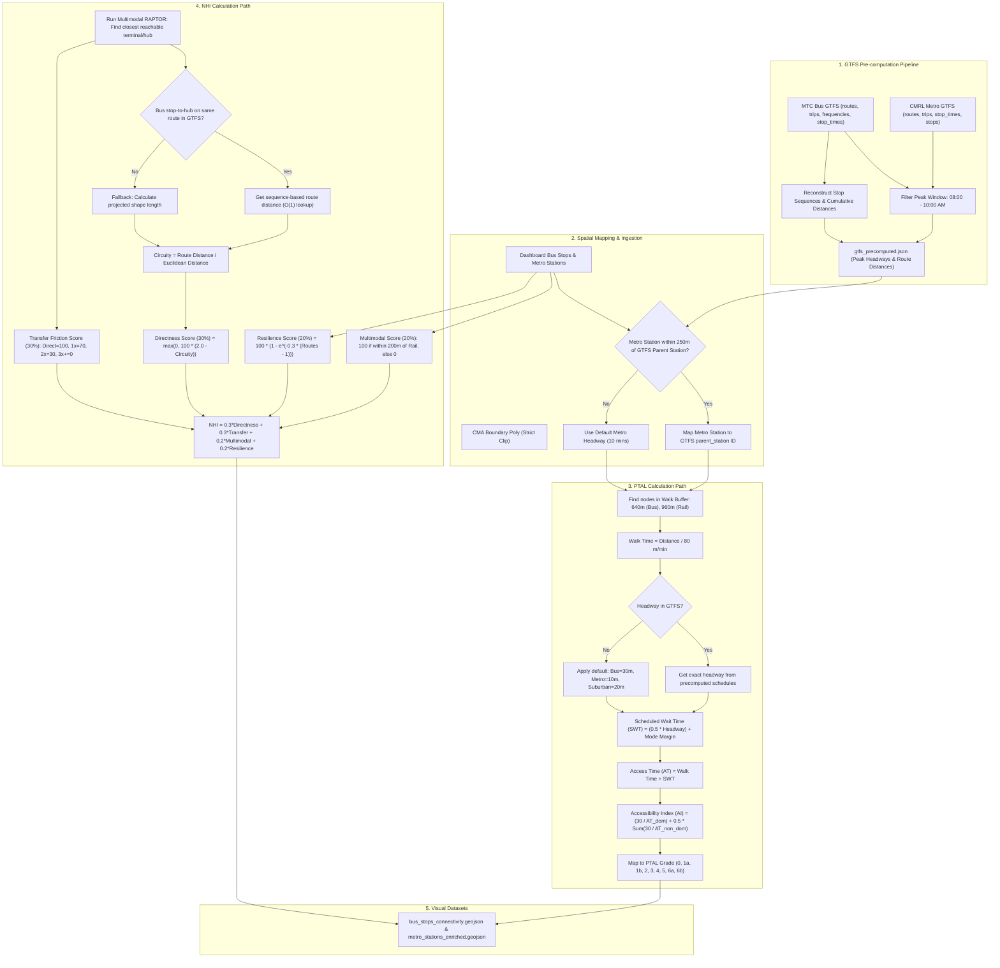

# CUMTA GTFS Integration: Detailed PTAL & NHI Calculation Logic

This document provides a comprehensive breakdown of the updated public transit routing, accessibility, and network health calculation methodologies deployed in the Chennai Multimodal Transit Connectivity Dashboard. It details the transition from heuristic route-count proxies to empirical schedule-based calculations using raw MTC (bus) and CMRL (metro) GTFS datasets.

---

## 1. System Logic Flowchart

The following flowchart outlines the entire sequence of data ingestion, spatial preprocessing, pre-computation, and mathematical calculations for the PTAL and NHI metrics:

---

## 2. Pre-Computation Pipeline (`precompute_gtfs_metrics.py`)

Processing raw, multi-gigabyte GTFS files on every page refresh is resource-prohibitive. To maintain a fluid, high-performance web dashboard, we designed a pre-computation pipeline that extracts schedules and route networks into a compiled JSON lookup file (`gtfs_precomputed.json`):

1. **MTC Bus Peak Headways:**
   * Reads raw MTC `frequencies.txt`, `trips.txt`, `stop_times.txt`, and `routes.txt`.
   * Filters all trips operating within the **morning peak window (08:00 to 10:00)**.
   * Maps each `stop_id` and its associated `route_short_name` to their exact peak headway in minutes:
     $$\text{Headway (mins)} = \frac{\text{headway\_secs}}{60.0}$$

2. **CMRL Metro Peak Headways:**
   * Ingests CMRL `stop_times.txt` and `trips.txt`.
   * Filters train arrival times at each station during the peak morning window (08:00 - 10:00).
   * Sorts arrivals chronologically and calculates the differences (headways) between consecutive trains.
   * Extracts the **median headway** across all platforms/directions per parent station.

3. **Sequence-Based Cumulative Distances:**
   * For each MTC bus route, the algorithm identifies the representative trip containing the maximum stop sequence.
   * Projects stop coordinates from WGS84 (`EPSG:4326`) to meters (`EPSG:32644`).
   * Iterates along the stop sequence to accumulate segment-to-segment Euclidean distances.
   * Stores a map of `{stop_id: cumulative_distance_meters}` for each route, enabling instantaneous $O(1)$ distance calculations.

---

## 3. Public Transport Accessibility Level (PTAL) Model

PTAL evaluates walking access and transit density from any stop to neighboring service entry points.

### 3.1 Walking Access Time ($WalkTime$)
The system queries all transit stops within walking buffers ($640\text{m}$ for buses/terminals, $960\text{m}$ for metro/suburban rail) using a projected coordinate distance calculation. Walk time is calculated assuming a constant walk speed of 80 meters/minute (4.8 km/h):
$$WalkTime_{i,j} = \frac{Distance_{i,j} \text{ (meters)}}{80 \text{ meters/minute}}$$

### 3.2 Scheduled Wait Time ($SWT$)
Determines the average time spent waiting for a service to arrive. It is defined as half of the peak headway plus a mode-specific operational reliability margin:
$$SWT_{j,r} = \left(0.5 \times Headway_{j,r}\right) + ReliabilityMargin_{mode}$$

* **Headway Lookup Logic:**
  * **MTC Bus:** Exact headway per route and stop from precomputed GTFS schedules. Fallback: **30.0 mins**.
  * **CMRL Metro:** Median peak headway per parent station from precomputed GTFS schedules. Dashboards nodes are spatially mapped to GTFS parent station coordinates (using a $<250\text{m}$ threshold) to resolve name mismatches (e.g., CMBT). Fallback: **10.0 mins**.
  * **Suburban Rail:** Since Southern Railway timetables are not public in GTFS, the model applies a standard peak headway default of **20.0 mins** (rather than route-count heuristics).
* **Reliability Margins:** Add a buffer for real-world delays:
  * Bus: **2.0 minutes**
  * Metro: **0.75 minutes**
  * Suburban: **1.50 minutes**

### 3.3 Accessibility Index ($AI$)
For any stop $i$, the total Access Times ($AT = WalkTime + SWT$) for all accessible routes are sorted. The dominant route $r_{dom}$ (minimum access time $AT_{dom}$) is weighted fully, while all non-dominant routes are weighted at 50% to account for redundancy:
$$AI_i = \left(\frac{30}{AT_{dom}}\right) + 0.5 \times \sum_{non-dom} \left(\frac{30}{AT_{non-dom}}\right)$$

### 3.4 PTAL Grade Mapping
The index value ($AI$) maps to grades `0` (Very Poor) to `6b` (Excellent) based on standard London PTAL thresholds:

| Grade | Lower Bound ($AI$) | Upper Bound ($AI$) | Description |
| :--- | :--- | :--- | :--- |
| **0** | $0.00$ | $0.00$ | No transit access |
| **1a** | $>0.00$ | $2.50$ | Very Poor |
| **1b** | $2.50$ | $5.00$ | Very Poor |
| **2** | $5.00$ | $10.00$ | Poor |
| **3** | $10.00$ | $15.00$ | Moderate |
| **4** | $15.00$ | $20.00$ | Good |
| **5** | $20.00$ | $25.00$ | Very Good |
| **6a** | $25.00$ | $40.00$ | Excellent |
| **6b** | $>40.00$ | $\infty$ | Excellent |

---

## 4. Network Health Index (NHI) Model

NHI measures the quality, efficiency, and robustness of transit options at each stop on a scale of 0 to 100:
$$NHI_i = 0.3 \times S_{directness} + 0.3 \times S_{transfer} + 0.2 \times S_{multimodal} + 0.2 \times S_{resilience}$$

### 4.1 Directness Score ($S_{directness}$ — 30%)
Measures transit circuity (detour factor) compared to straight-line distance to the closest reachable terminal/hub:
$$\text{Circuity}_i = \frac{\text{RouteDistance}_{i,\text{hub}}}{\text{EuclideanDistance}_{i,\text{hub}}}$$

* **GTFS Sequence Distance:** For MTC buses, the route distance is calculated by looking up the stop's cumulative sequence coordinates relative to the hub's cumulative coordinates:
  $$\text{RouteDistance} = |\text{CumulativeDist}_{\text{stop}} - \text{CumulativeDist}_{\text{hub}}|$$
  This eliminates projection circuity errors and bypasses shape snapping issues. The projected shape geometry length is used as a fallback only for non-GTFS routes.
* **Score Mapping:**
  $$S_{directness} = \max\left(0, 100 \times \left(2.0 - \text{Circuity}_i\right)\right)$$
  *(For stops with 0 transfers, $S_{directness}$ is set to 100. For stops with 2 transfers (3 routes), directness defaults to 50, and 3 transfers defaults to 0.)*

### 4.2 Transfer Friction Score ($S_{transfer}$ — 30%)
Penalizes routes that require multiple transfers to connect to the closest terminal:
* **Direct connection** (0 transfers required): **100 points**
* **1 transfer** (2 routes required): **70 points**
* **2 transfers** (3 routes required): **30 points**
* **3+ transfers / Disconnected:** **0 points**

### 4.3 Multi-Modal Integration ($S_{multimodal}$ — 20%)
Measures intermodal transfer availability. Awards **100 points** if the stop is within **200 meters** walking distance of a Metro or Suburban Rail station, promoting integration between road and rail; otherwise **0 points**.

### 4.4 Network Resilience ($S_{resilience}$ — 20%)
Measures the stop's robustness against service disruptions. Resilience score increases exponentially with the number of unique serving routes:
$$S_{resilience} = 100 \times \left(1 - e^{-0.3 \times \left(RoutesCount_i - 1\right)}\right)$$
*Stops served by only 1 route receive 0 points.*

---

## 5. Comparative Statistics: Heuristic vs. GTFS Empirical Calculations

Transitioning the pipeline to use empirical schedules from CUMTA GTFS data (MTC & CMRL) corrected over-optimistic heuristic assumptions, highlighting true accessibility gaps:

* **Average PTAL Index:** Decreased from **51.71** (heuristic) to **22.05** (empirical), reflecting realistic scheduled wait times rather than optimistic route-count defaults.
* **Average Network Health:** Adjusted to **58.7%** (from 58.2%), refined by sequence-based circuity distance lookups.
* **PTAL Grade Distribution:**
  * **Grade 1a (Very Poor):** 587 stops
  * **Grade 1b (Very Poor):** 418 stops
  * **Grade 2 (Poor):** 698 stops
  * **Grade 3 (Moderate):** 375 stops
  * **Grade 4 (Good):** 303 stops
  * **Grade 5 (Very Good):** 356 stops
  * **Grade 6a (Excellent):** 784 stops
  * **Grade 6b (Excellent):** 624 stops
* **NHI Health Classification Counts:**
  * **Excellent (90-100):** 101 stops
  * **Good (70-89):** 1,143 stops
  * **Moderate (50-69):** 1,756 stops
  * **Weak (30-49):** 1,085 stops
  * **Critical (0-29):** 60 stops
