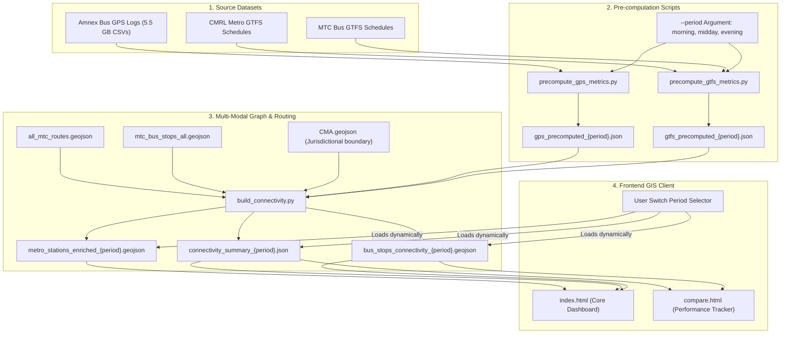

# Knowledge Transfer: Chennai Multimodal Transit Connectivity and Performance Gap Dashboard

This document provides a comprehensive, engineering-grade transfer of knowledge for the Chennai transit connectivity modeling and operational performance gap project. It details the system architecture, ETL pipelines, mathematical formulations, data schemas, frontend designs, and operational maintenance.

---

## 1. System Architecture Overview

The system consists of a decoupled, high-performance data processing pipeline and a lightweight, database-free web dashboard. 

### Data Flow and Pipeline Sequence



---

## 2. Ingested Data and Pre-Computation Strategies

To bypass live-database bottlenecks on the client side, heavy computation is shifted to pre-computation scripts.

### 2.1 GTFS Schedule Pre-Computation (`precompute_gtfs_metrics.py`)
This script compiles timetables, frequencies, and route layouts for the MTC bus and CMRL metro systems:
1. **MTC Peak Headways**: Reads MTC `frequencies.txt`, `trips.txt`, `stop_times.txt`, and `routes.txt`. Trips operating inside the selected period are matched to stops to calculate scheduled headways.
2. **CMRL Peak Headways**: Ingests CMRL stop times, extracts train arrivals during the active window, sorts them chronologically, and calculates platform headways. The median headway is selected per parent station.
3. **Sequence-Based Distance Accumulation**: Projects route coordinates to meters (`EPSG:32644`), identifies the representative trip containing the maximum stop sequence for each MTC route, and computes the cumulative distance mapping `{stop_id: cumulative_distance_meters}` along the route.

### 2.2 GPS Telemetry Pre-Computation (`precompute_gps_metrics.py`)
This script digests over 5.5 GB of raw bus GPS coordinates (Amnex, May 20, 2026):
1. **Grid-Based Spatial Indexing**: Maps GPS pings ($N \approx 560,000$) to bus stops ($M = 5,608$) using a spatial grid cell index of 0.002-degree bins (~220m). GPS coordinates are queried against only the matching and neighboring grid cells, reducing mapping search time to a constant $O(1)$ lookup. Pings are matched to stops within a 100m threshold.
2. **Speed Reconstruction**: Because the raw telemetry speed column was empty, coordinate displacements ($\Delta x, \Delta y$) and time differences ($\Delta t$) between consecutive pings of each unique vehicle are computed to reconstruct speeds.
3. **Arrival & Visit Detection**: Groups consecutive pings from the same vehicle at a stop within 10 minutes into a single "visit".
4. **Empirical Headways**: Visits are sorted chronologically per stop and route, and the mean headway and standard deviation (for headway consistency) are computed.

### 2.3 Time Period Partitioning (IST to UTC Mapping)
The GPS CSV files contain timestamps in UTC, while GTFS schedules use local IST time (UTC + 5:30). The pipeline partitions the periods as follows:

| Period | Local IST Window | UTC GPS Window | Ingested GPS CSV Files |
| :--- | :---: | :---: | :---: |
| **Morning Peak** | 08:00 - 10:00 AM | 02:30:00 - 04:30:00 | `_06-09.csv` & `_09-12.csv` |
| **Midday Off-Peak** | 12:00 - 02:00 PM | 06:30:00 - 08:30:00 | `_12-15.csv` |
| **Evening Peak** | 05:00 - 07:00 PM | 11:30:00 - 13:30:00 | `_15-18.csv` & `_18-21.csv` |

---

## 3. Mathematical Formulations

The main model ([build_connectivity.py](file:///Volumes/Sandisk%20SSD/Depot_analysis/connectivity_dashboard/build_connectivity.py)) uses these precomputed datasets to calculate accessibility and network health.

### 3.1 Public Transport Accessibility Level (PTAL)
PTAL models door-to-door transit accessibility at each stop:
1. **Walking Access Time ($WalkTime$)**: Walk time (assuming 80 m/min speed) to all stops within walk buffers ($640\text{m}$ for bus, $960\text{m}$ for rail):
   $$WalkTime_{j} = \frac{\text{Distance (meters)}}{80}$$
2. **Scheduled Wait Time ($SWT$)**: Derived from precomputed scheduled/empirical headways, incorporating mode margins:
   $$SWT_{j,r} = \left(0.5 \times Headway_{j,r}\right) + ReliabilityMargin_{mode}$$
   *Reliability Margins: Bus = 2.0 min, Metro = 0.75 min, Suburban = 1.50 min.*
3. **Access Time ($AT$)**: $AT_{j,r} = WalkTime_{j} + SWT_{j,r}$
4. **Accessibility Index ($AI$)**: Sorts all accessible routes. The dominant route $AT_{dom}$ is weighted fully; all other routes are weighted at 50%:
   $$AI_i = \frac{30}{AT_{dom}} + 0.5 \times \sum_{non-dom} \left(\frac{30}{AT_{non-dom}}\right)$$

### 3.2 Network Health Index (NHI)
NHI scores operational efficiency and quality on a scale of 0 to 100.

#### A. Timetabled Schedule-Based NHI:
$$NHI_{Sch} = 0.3 \times S_{directness} + 0.3 \times S_{transfer} + 0.2 \times S_{multimodal} + 0.2 \times S_{resilience}$$
* **Directness ($S_{directness}$ — 30%)**: Measures transit routing circuity to the closest terminal:
  $$\text{Circuity}_i = \frac{\text{Route Distance}}{\text{Euclidean Distance}}$$
  $$S_{directness} = \max\left(0, 100 \times \left(2.0 - \text{Circuity}_i\right)\right)$$
* **Transfer Friction ($S_{transfer}$ — 30%)**: Evaluates routing hops computed via a multimodal RAPTOR routing graph (Direct = 100, 1 transfer = 70, 2 transfers = 30, 3+ transfers = 0).
* **Multi-Modal Integration ($S_{multimodal}$ — 20%)**: 100 points if the stop is within 200m of a Metro or Suburban Rail station; otherwise 0.
* **Network Resilience ($S_{resilience}$ — 20%)**: Measures route redundancy:
  $$S_{resilience} = 100 \times \left(1 - e^{-0.3 \times \left(RoutesCount - 1\right)\right)}$$

#### B. GPS-Empirical NHI:
Replaces the static $S_{resilience}$ score (20%) with two dynamic real-world operational performance parameters (10% each):
$$NHI_{GPS} = 0.3 \times S_{directness} + 0.3 \times S_{transfer} + 0.2 \times S_{multimodal} + 0.1 \times S_{reliability} + 0.1 \times S_{speed}$$
* **Headway Reliability ($S_{reliability}$ — 10%)**: Measures headway consistency using the Coefficient of Variation ($CV = \sigma / \mu$) of observed arrivals. PENALIZES bunched services:
  - If $CV \le 0.2$ (highly regular): Score = 100
  - If $CV \ge 1.2$ (severely bunched/irregular): Score = 0
  - Otherwise, scores are linearly scaled.
* **Travel Speed ($S_{speed}$ — 10%)**: Evaluates congestion. Average observed bus speed (km/h) mapped to a scale:
  - Speed $\ge 25\text{ km/h}$: Score = 100
  - Speed $\le 6\text{ km/h}$: Score = 0
  - Otherwise, scores are linearly scaled.

---

## 4. Frontend Web Dashboard Architecture

The dashboards are built with Vanilla HTML5, Leaflet.js, and clean CSS, bypassing complex frameworks.

### 4.1 Core Dashboard (`index.html`)
* **Period Toggle**: The dropdown select triggers `switchPeriod(period)`.
* **Dynamic Reloading**: Fetches `bus_stops_connectivity_{period}.geojson`, `connectivity_summary_{period}.json`, and `metro_stations_enriched_{period}.geojson` concurrently.
* **Layer Redrawing**: Clears old Leaflet layers and runs `redrawOperationalLayers()` to render new stop markers and tooltips.
* **KPI & Chart Rendering**: Rebuilds the KPIs (mean PTAL, NHI, direct stop counts) and sidebar bar charts (`drawBars`) utilizing the summary JSON.

### 4.2 Performance Gap Dashboard (`compare.html`)
* **Diverging Color Scale**: Colors markers on a Red-Gray-Green ramp representing observed operational deltas:
  $$\Delta PTAL = PTAL_{GPS} - PTAL_{Sch}$$
  $$\Delta NHI = NHI_{GPS} - NHI_{Sch}$$
  - 🟢 **Green (Variance > 0.5)**: Service performing better/faster than scheduled.
  - ⚪ **Gray (Variance -0.5 to 0.5)**: On schedule / no variance.
  - 🔴 **Red (Variance < -0.5)**: Delays, bunching, or severe congestion.
* **Top 5 Bottlenecks Panel**: Filters stops inside the CMA boundary, sorts them by the most negative variance ($\Delta$), and lists them in the sidebar. Clicking any item pans the Leaflet map (`map.setView`) to that stop coordinates and opens its popup.

---

## 5. Maintenance and Pipeline Execution

When GTFS schedules or GPS telemetry logs are updated:

### 1. Ingest Raw Files
* Place new GTFS files inside `/Users/bharatoraon/Desktop/Project_1/CUMTA_GTFS/MTC` and `/Users/bharatoraon/Desktop/Project_1/CUMTA_GTFS/CMRL`.
* Place new raw GPS CSV logs inside `/Volumes/Sandisk SSD/Depot_analysis/Bus_GPS_Data`.

### 2. Execute the Pipeline
Run the pre-computation and build connectivity scripts for all three periods sequentially:

```bash
# Navigate to the dashboard directory
cd "/Volumes/Sandisk SSD/Depot_analysis/connectivity_dashboard"

# MORNING PEAK (08:00 - 10:00 AM IST)
python3 precompute_gps_metrics.py --period morning
python3 precompute_gtfs_metrics.py --period morning
python3 build_connectivity.py --period morning

# MIDDAY OFF-PEAK (12:00 - 02:00 PM IST)
python3 precompute_gps_metrics.py --period midday
python3 precompute_gtfs_metrics.py --period midday
python3 build_connectivity.py --period midday

# EVENING PEAK (05:00 - 07:00 PM IST)
python3 precompute_gps_metrics.py --period evening
python3 precompute_gtfs_metrics.py --period evening
python3 build_connectivity.py --period evening
```

### 3. Launch the Server
Launch the HTTP server to serve the workspace:
```bash
python3 -m http.server 8765
```
Open **[http://localhost:8765/index.html](http://localhost:8765/index.html)** or **[http://localhost:8765/compare.html](http://localhost:8765/compare.html)** in your browser and refresh.
