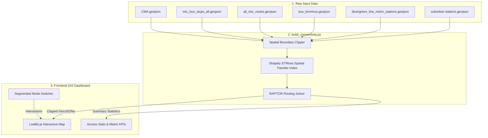

# Chennai Multimodal Transit Connectivity Dashboard

An interactive, high-performance GIS dashboard to analyze transit connectivity, coverage, and underserved transit deserts within the Chennai Metropolitan Area (CMA). This repository contains the Python ETL pipeline (implementing the RAPTOR routing algorithm) and the frontend Leaflet dashboard.

---

## 🚀 Key Features

* **Dual Routing Analysis Modes:** Switch between **Bus-Only** (MTC network only) and **Multimodal** (incorporating Chennai Metro Rail and Suburban Railways).
* **Underserved Focus Explorer:** A dedicated analysis mode highlighting transit deserts (stops requiring 2+ transfers) with a searchable list and auto-zooming.
* **Proximity Tooltips:** Hovering over any stop icon immediately displays its closest accessible transit terminal/hub and its geographic distance in kilometers.
* **Granular Population Coverage Metrics:** Visualizes spatial coverage within the CMA boundary using strict spatial clipping.

---

## 🛠️ Tech Stack & System Architecture

The project consists of two main parts:
1. **Python ETL Engine (`build_connectivity.py`):** Uses Shapely, GeoPandas, and STRtree spatial indices to run a custom public transit routing solver (RAPTOR).
2. **Frontend GIS Application (`index.html`):** A lightweight Leaflet-based single-page application styled using modern dark-slate themes, CSS variables, and fluid transitions.



---

## 🧭 RAPTOR Routing Solver Specification

The core routing engine implements a round-based public transit algorithm:
* **Footpath Indexing:** Walks are restricted to $\le$ 200 meters. Stop-to-stop walking transfers are indexed dynamically using a Shapely `STRtree` spatial query.
* **Geographic Closest Terminal:** Calculates the closest accessible terminal geographically for every stop and exposes its name and distance in the GeoJSON outputs.

---

## 💻 Local Setup & Running

### 1. Requirements
Ensure you have Python 3 and standard dependencies installed:
```bash
pip install shapely geopandas fiona
```

### 2. Run ETL Pipeline
Re-generate the connectivity data by running the pipeline script inside the `connectivity_dashboard` directory:
```bash
cd connectivity_dashboard
python3 build_connectivity.py
```

### 3. Run Locally
To run the Leaflet dashboard, serve it using a local HTTP server:
```bash
python3 -m http.server 8080
```
Then open `http://localhost:8080` in your web browser.
