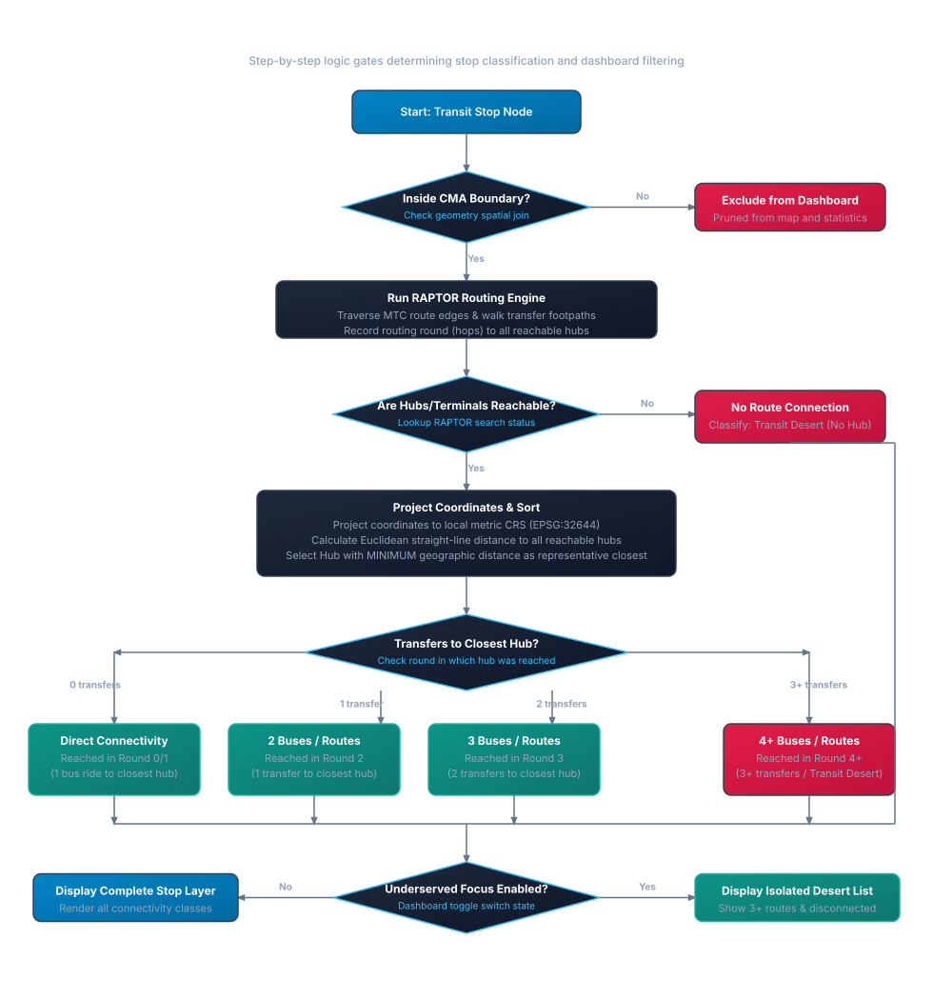
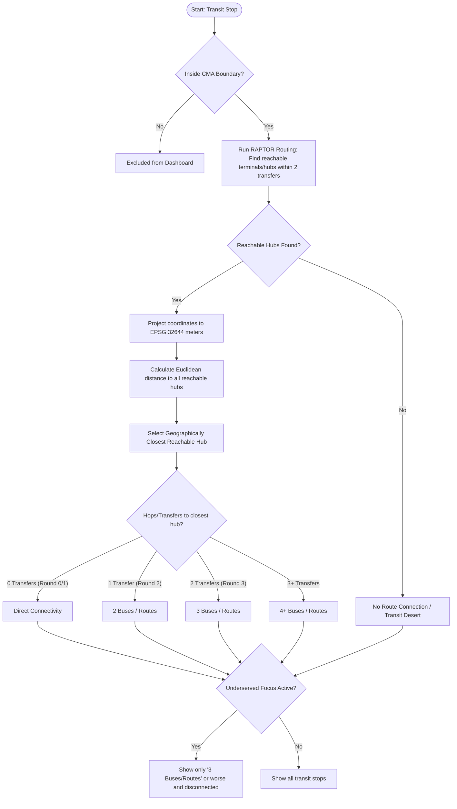
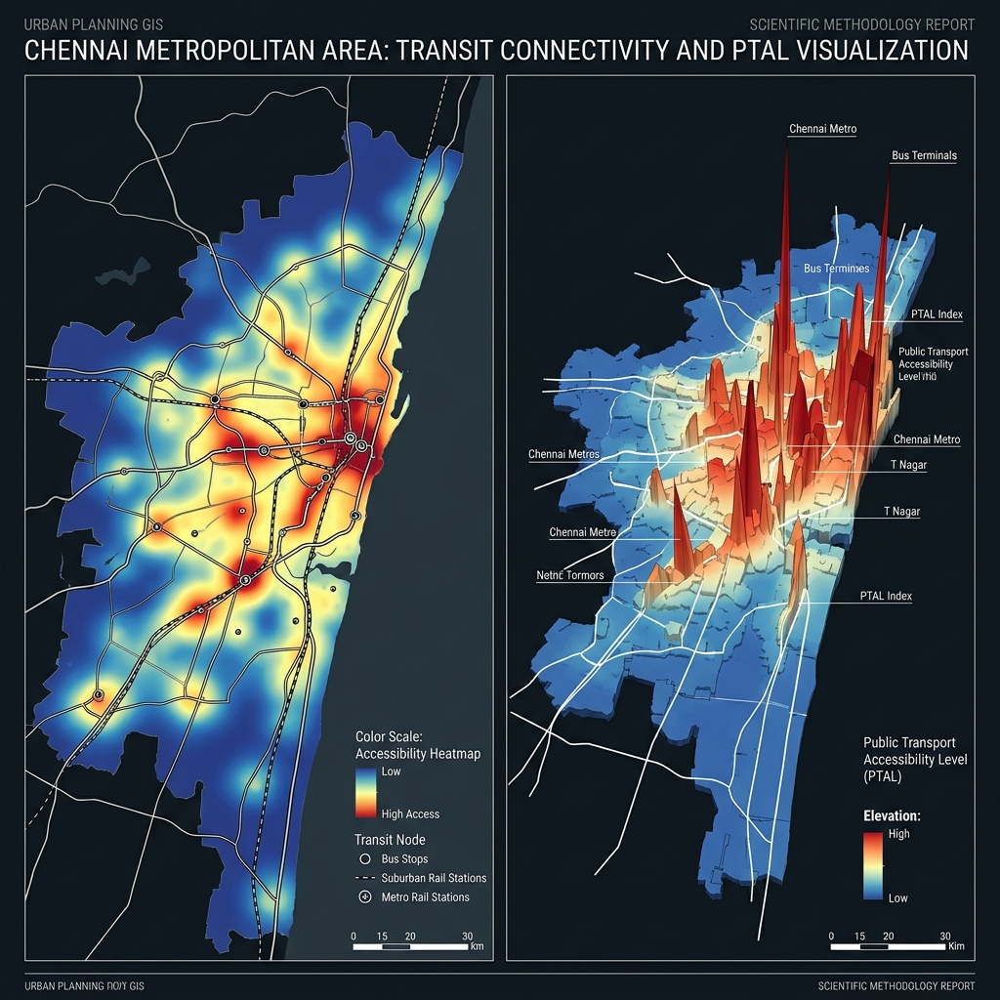

# Methodology & Technical Architecture Report
## Chennai Multimodal Transit Connectivity Dashboard

This document details the methodology, calculation logic, and technology stack used to develop the Chennai Multimodal Transit Connectivity Dashboard.

---

## Methodology Flowchart & Decision Tree

Below are the visual reference charts detailing the implementation methodology:
1. **System Methodology Flowchart**: The step-by-step data processing pipeline, from raw GIS inputs to graph construction, RAPTOR routing, and visualization.
2. **Stop Connectivity Classification Decision Tree**: The logical routing decision rules that determine the connectivity category of each stop based on geographic proximity to reachable transit hubs.
3. **CMA Transit Connectivity & 3D PTAL Heatmap**: A spatial density representation showing both the 2D density of transit accessibility across the Chennai Metropolitan Area and a 3D extruded rendering of PTAL indices where higher peaks represent high accessibility concentrations.

---

### 1. System ETL & Data Processing Flowchart

```mermaid
graph TD
    subgraph Input [1. Input Data Layers]
        BusStops["MTC Bus Stops (GeoJSON)"]
        BusRoutes["MTC Bus Routes (GeoJSON)"]
        Termini["Bus Termini (GeoJSON)"]
        Metro["Metro Stations & Corridors (GeoJSON)"]
        Suburban["Suburban Stations & Corridors (GeoJSON)"]
        CMABoundary["CMA Boundary Polygon"]
    end

    subgraph Preprocess [2. Spatial Ingestion & Preprocessing]
        BoundaryClip["Spatial Clip: Prune stops/routes outside CMA boundary"]
        TextSanitize["Name Sanitization: Lowercase & strip 'depot/terminus/stand'"]
        RouteRegex["Regex Route List Parsing: Parse semicolon/comma-separated strings"]
    end

    subgraph Graph [3. Network Graph Construction]
        Nodes["Nodes: Stops, Terminals, Metro/Suburban Stations"]
        RouteEdges["Route Edges: Connect stops sharing same route name"]
        WalkEdges["Walk Transfer Footpaths: Connect stops within 200m radius using STRtree"]
    end

    subgraph Raptor [4. RAPTOR Routing Engine]
        Round0["Round 0: Initialize accessible terminals (0 transfers)"]
        Round1["Round 1: Traverse direct routes (Direct / 0 transfers)"]
        Round2["Round 2: Traverse 1-transfer routes (2 buses/routes / 1 transfer)"]
        Round3["Round 3: Traverse 2-transfer routes (3 buses/routes / 2 transfers)"]
    end

    subgraph Proximity [5. Proximity & Representative Selection]
        ProjMeters["Coordinate Projection: Project coordinates from WGS84 to EPSG:32644 (meters)"]
        CalcDist["Euclidean Distance: Calculate distance to all reachable terminals"]
        ClosestHub["Select Closest: Sort by distance & select closest reachable terminal"]
        SetMetric["Set Score: Set connectivity metric based on that closest reachable terminal"]
    end

    subgraph Output [6. Outputs & Dashboard Visuals]
        StopsGeoJSON["bus_stops_connectivity.geojson"]
        SummaryStats["connectivity_summary.json"]
        LeafletMap["Interactive Leaflet Dashboard (index.html)"]
    end

    Input --> Preprocess
    Preprocess --> Graph
    Graph --> Raptor
    Raptor --> Proximity
    Proximity --> Output
```

---

### 2. Stop Connectivity Classification Decision Tree

---

### 3. Chennai 2D Transit Heatmap & 3D Extruded PTAL Visualization

Below is the scientific GIS visualization mapping the transit connectivity density of the Chennai Metropolitan Area. The left panel shows the 2D accessibility heatmap (representing access density zones), and the right panel shows the 3D extruded terrain height map representing the Public Transport Accessibility Level (PTAL), where the highest red/orange peaks correspond to transit hubs with high service densities (e.g., Chennai Central, T. Nagar).

---

## 1. System Architecture & Technologies

The system is designed as a two-tier architecture consisting of a heavy offline geospatial ETL (Extract, Transform, Load) pipeline and a lightweight frontend visualization layer.

### 1.1 Tech Stack
* **Python 3**: Core language for the ETL engine (`build_connectivity.py`).
* **GeoPandas & Fiona**: Used for reading, parsing, and manipulating GeoJSON datasets.
* **Shapely**: Powers the core geometric operations, spatial joins, and clipping. Specifically, `Shapely.prepared` is used for fast spatial containment checks, and `Shapely.strtree` is used for fast proximity indexing.
* **PyProj**: Used for precise Geographic to Projected Coordinate System transformations (WGS84 `EPSG:4326` to `EPSG:32644`), enabling accurate distance calculations in meters.
* **Leaflet.js**: Frontend mapping library used in `index.html` to render the GeoJSON outputs interactively without a heavy GIS server.

---

## 2. Methodology & Graph Construction

The core of the analysis relies on modeling the transit network as a spatial and relational graph. 

### 2.1 Node Definition
Nodes in the graph represent transit access points:
* **Bus Stops**: Extracted from `mtc_bus_stops_all.geojson`.
* **Bus Terminals / Depots**: A unified category combining explicitly mapped terminals and implied depots (inferred from route endpoints).
* **Metro Stations**: Explicitly modeled for the Blue and Green lines.
* **Suburban Stations**: Extracted from `suburban stations.geojson`.

### 2.2 Edge Construction (Routes & Walking)
The connections between nodes (edges) are formed in two ways:
1. **Route Edges**: Two stops are connected if they are served by the exact same transit route (bus route name, metro line, or suburban line).
2. **Walking Transfer Footpaths**: An R-Tree spatial index (`STRtree`) is constructed over all transit nodes. The system queries this index to link any two nodes located within **200 meters** of each other geographically. This represents a walkable transfer between stops or different transit modes.

### 2.3 Terminal Inference Logic
Because not all bus depots were mapped as point features in the raw data, the script uses a spatial inference technique:
* It analyzes the source/destination string attributes of all bus routes.
* If a route endpoint string contains the word "depot", the geographic ends of that route's LineString geometry are clustered.
* Mapped terminals are also spatially joined against route endpoints; any route terminating within **650 meters** of a mapped terminal is considered to serve that terminal directly.

---

## 3. Routing Calculations (RAPTOR Algorithm)

To determine how well-connected each stop is, the system implements a round-based public transit routing algorithm similar to **RAPTOR (Round-Based Public Transit Routing)**.

### 3.1 Dual Analysis Modes
The RAPTOR algorithm is executed twice to create two distinct datasets:
1. **Bus-Only Network**: Restricts valid edges strictly to MTC Bus routes and walking paths between bus stops/terminals.
2. **Multimodal Network**: Expands the graph to include Metro and Suburban rail lines as valid transit segments.

### 3.2 Closest Facility Distance & Routing Selection
For every stop, the algorithm tracks **all** terminals/hubs it can reach in the transit graph within 3 rounds (up to 2 transfers). To select the representative terminal/hub for a stop:
1. The coordinates of the stop and all its accessible terminals are projected from degrees (`EPSG:4326`) to meters (`EPSG:32644`) using PyProj.
2. A straight-line Euclidean distance is calculated between the stop and each of the accessible terminals.
3. The terminal with the smallest geographic distance is selected as the **Closest Terminal** (or **Closest Hub** in Multimodal mode) and reported in kilometers on the dashboard's proximity tooltip.
4. The stop's connectivity score (hops/transfers) is set to match the specific route-transfer distance to **that geographically closest reachable terminal**. This ensures that the connectivity metric is tied to the physical proximity of the nearest reachable hub, rather than a far-away direct terminal.

### 3.3 Connectivity Classification
Stops are classified based on the transfers required to reach their geographically closest reachable terminal/hub:
* **Direct**: The stop can reach its closest terminal in a single transit route segment (0 transfers).
* **2 buses/routes**: Requires taking 1 route, walking/transferring, and taking a 2nd route (1 transfer).
* **3 buses/routes**: Requires 2 transfers.
* **4+ buses/routes**: Requires 3 or more transfers (often considered a "transit desert").
* **No route connection**: The stop cannot reach any terminal/hub via the transit graph.

### 3.4 Underserved Focus definition
The dashboard features an "Underserved Focus" analysis layer that isolates and displays stops with poor connectivity. To target the true transit deserts, this focus is defined as stops requiring **2 or more transfers** (`3 buses` / `3 routes` or worse, as well as disconnected stops), excluding stops with direct or 1-transfer connectivity.

---

## 4. Spatial Processing & QA 

* **Strict Boundary Clipping**: Using `Shapely.prepared`, a unified boundary of the Chennai Metropolitan Area (CMA) is created. All stops and routes are clipped; stops outside the CMA boundary are discarded from the final dashboard output to maintain strict geographical scope.
* **QA Overrides**: A manual QA dictionary forces specific stops (e.g., Kundrathur Bus Depot, CMBT) into the "Direct" connectivity category to correct for upstream malformed strings in the raw stop attributes that the automated parser could not link.

---

## 5. Logic & Data Purity

Maintaining clean and reliable connectivity graphs required significant data purity and normalization logic due to inconsistencies in the raw MTC route and stop datasets:

### 5.1 String Normalization and Sanitization
The raw data contained highly variable text strings for stops, routes, and destinations. The ETL pipeline implements a strict sanitization protocol:
* **Token Standardization**: Words like "bus", "mtc", "terminus", "terminal", "stand", "depot", "jn", and "junction" are systematically stripped out of route endpoint labels and stop names to prevent mismatching due to minor naming variations.
* **Non-Alphanumeric Stripping**: Special characters are converted to spaces, and all strings are collapsed into lowercase, single-spaced standard strings.

### 5.2 Malformed Route Array Parsing
In the source `mtc_bus_stops_all.geojson` data, the `route name` field was often a malformed text string (e.g., strings containing brackets, commas, semicolons, and quotes) instead of a clean JSON array. 
* A custom string parser uses regular expressions (`re.split(r"[,;/]", value)`) to clean bracket and quote characters and reconstruct valid lists of routes serving each stop. This prevented many stops from falsely registering as "No route connection" (such as the Metrological Department Sterling Road stop which produced 27 valid matches after cleaning).

### 5.3 QA Interventions
Despite algorithmic cleaning, manual QA interventions were applied to guarantee data integrity:
* Hardcoded validations override the algorithm for specific critical infrastructure nodes whose upstream route strings were too malformed to parse automatically. For instance, "Chennai Koyambedu Mofussil Bus Stand" and "Kundrathur Bus Depot" were explicitly mapped as "Direct" connectivity points based on manual map validation.

---

## 6. Public Transport Accessibility Level (PTAL)

PTAL measures walking access and transit service density from a stop's perspective using a standardized door-to-door transit accessibility index.

### 6.1 Mathematical Formulation

1. **Walking Access Time ($WalkTime$):**
   Calculates walk times from a stop to all neighboring nodes within 640 meters (buses/terminals) and 960 meters (metro/suburban rail), assuming a walk speed of 80 meters/minute (4.8 km/h).
   $$WalkTime_{i,j} = \frac{Distance_{i,j}}{80 \text{ meters/minute}}$$

2. **Scheduled Wait Time ($SWT$):**
   $$SWT_{j,r} = (0.5 \times Headway_{j,r}) + ReliabilityMargin_{mode}$$
   * **Empirical Peak Headways:** Exact route headways are extracted from CUMTA MTC and CMRL GTFS schedules during the morning peak hour (**08:00 - 10:00**). CMRL Metro parent stations are spatially joined (within 250m) to map stations to GTFS parent stations.
   * **Defaults & Fallbacks:** 
     * MTC Bus: exact headway from GTFS peak schedule; fallback to 30.0 mins.
     * CMRL Metro: exact median peak headway; fallback to 10.0 mins.
     * Suburban Rail: standard default of 20.0 mins during peak hours.
     * Heuristic Fallback (if GTFS is missing entirely): route-count proxy ($>10$ routes: 5m, $5\text{--}10$ routes: 10m, $2\text{--}4$ routes: 15m, 1 route: 30m).
   * **Reliability Margins:** Bus = 2.0 min, Metro = 0.75 min, Suburban = 1.50 min.

3. **Accessibility Index ($AI$):**
   The dominant route (minimum access time $AT_{dom} = WalkTime + SWT$) is weighted fully (100%), while all other accessible routes are weighted at 50%:
   $$AI_i = \left(\frac{30}{AT_{dom}}\right) + 0.5 \times \sum_{non-dom} \left(\frac{30}{AT_{non-dom}}\right)$$

4. **PTAL Grade Mapping:**
   The calculated Accessibility Index ($AI$) is mapped to PTAL grades based on standard London thresholds:
   * **Grade 0 (Very Poor):** $AI = 0.0$
   * **Grade 1a:** $0.0 < AI \le 2.5$
   * **Grade 1b:** $2.5 < AI \le 5.0$
   * **Grade 2:** $5.0 < AI \le 10.0$
   * **Grade 3:** $10.0 < AI \le 15.0$
   * **Grade 4:** $15.0 < AI \le 20.0$
   * **Grade 5:** $20.0 < AI \le 25.0$
   * **Grade 6a:** $25.0 < AI \le 40.0$
   * **Grade 6b (Excellent):** $AI > 40.0$

---

## 7. Network Health Index (NHI)

NHI evaluates the quality, reliability, and redundancy of transit services from a stop's perspective on a scale of 0 to 100.
$$NHI_i = 0.3 \times S_{directness} + 0.3 \times S_{transfer} + 0.2 \times S_{multimodal} + 0.2 \times S_{resilience}$$

### 7.1 Directness Score ($S_{directness}$, 30%)
Compares actual transit route distance to Euclidean straight-line distance to the closest hub. Circuity is defined as $RouteDistance / EuclideanDistance$:
* **Sequence-Based Distance:** For bus stops on the same route, the exact route distance is calculated by accumulating stop-to-stop segment distances along the GTFS stop sequence, eliminating shape projection circuity errors. A shape projection method is kept as a fallback for non-GTFS routes.
* **Calculation:**
  $$S_{directness} = \max\left(0, 100 \times \left(2.0 - Circuity_i\right)\right)$$
* For stops with $0$ transfers, directness is set to 100. For stops with 2 transfers (3 routes), directness defaults to 50, and 3 transfers defaults to 0.

### 7.2 Transfer Friction Score ($S_{transfer}$, 30%)
Assesses ease of connection to key hubs based on transit hops to the geographically closest reachable terminal:
* **Direct connection (0 transfers):** 100 points
* **1 transfer (2 routes):** 70 points
* **2 transfers (3 routes):** 30 points
* **3+ transfers / Disconnected:** 0 points

### 7.3 Multi-Modal Integration ($S_{multimodal}$, 20%)
Measures proximity to rapid transit modes. Awards **100 points** if the stop is within **200 meters** walking distance of a Metro or Suburban Rail station (acting as a multimodal transfer point), otherwise **0 points**.

### 7.4 Network Resilience ($S_{resilience}$, 20%)
Measures protection against single-line failures through route redundancy:
$$S_{resilience} = 100 \times \left(1 - e^{-0.3 \times \left(RoutesCount_i - 1\right)}\right)$$
For stops served by only 1 route, the resilience score is 0.

---

## 8. GPS-Empirical Operations & Performance Gap Analysis

While theoretical models are useful baseline indicators of structural transit access, actual commuter wait times and service reliability vary under real-world traffic conditions. To bridge this gap, the pipeline integrates raw GPS telemetry logs of the MTC bus fleet (May 20, 2026 morning peak hour 08:00 - 10:00 AM IST) representing over 5.5 GB of raw operations data.

### 8.1 High-Performance Spatial Indexing
Mapping 560,000+ raw GPS coordinate pings to the 4,145 transit stop points presents a computational bottleneck ($O(N \times M)$ search time). We resolved this by partitioning the transit stops into a spatial grid cell index of 0.002-degree bins. Each GPS ping is queried against only the corresponding and adjacent grid cells, reducing mapping lookups to a near constant $O(1)$ search time. Pings were successfully filtered and matched to served stops within a 100-meter threshold in under 60 seconds.

### 8.2 Travel Speed Reconstruction
Since the raw speed data attributes were empty in the source telemetry datasets, average bus travel speeds were reconstructed dynamically. The algorithm calculates coordinate displacements ($\Delta x, \Delta y$) using chronological coordinate timestamps ($\Delta t$) between consecutive pings for each unique vehicle ID, establishing real-world speeds along the transit routes.

### 8.3 GPS-Empirical PTAL Accessibility
Standard scheduled headways were replaced with GPS-observed headways (calculated as chronological gaps between consecutive arrivals at each stop). Real wait times were then computed as $SWT = (0.5 \times Headway_{GPS}) + 2.0\text{ mins}$ (including a 2.0-minute bus reliability margin), which were fed directly into the London PTAL Accessibility Index formula to visualize actual door-to-door accessibility levels.

### 8.4 GPS-Empirical Network Health (NHI)
The operational Network Health Index (NHI) was upgraded by replacing the static "Network Resilience" score (20%) with two dynamic real-time performance attributes, weighted at 10% each:
* **Headway Reliability ($S_{reliability}$):
  Evaluates headway consistency based on the Coefficient of Variation ($CV = \sigma / \mu$) of stop headways. Stops with high irregularity (e.g. bus bunching where $CV > 1.0$) are heavily penalized.
* **Travel Speed ($S_{speed}$):
  Scores stops based on average observed travel speeds, directly incorporating traffic congestion penalties into the transit quality index.

$$NHI_{GPS} = 0.3 \times S_{directness} + 0.3 \times S_{transfer} + 0.2 \times S_{multimodal} + 0.1 \times S_{reliability} + 0.1 \times S_{speed}$$

### 8.5 Performance Gap Mapping (Diverging Delta Layers)
To identify where Chennai's transit network fails to meet timetables, we developed a dedicated variance mapping module (`compare.html`). For each stop, the dashboard computes the performance gap:
$$\Delta PTAL = PTAL_{GPS} - PTAL_{Sch}$$
$$\Delta NHI = NHI_{GPS} - NHI_{Sch}$$

These deltas are visual-mapped using a diverging Red-Gray-Green color scale to allow planners to instantly target operational bottlenecks (Red) and transit gains (Green) across the metropolitan region.

### 8.6 Multi-Period Temporal Comparative Analysis
To examine transit operations across different travel conditions, the analysis has been extended to support three distinct time periods:
1. **Morning Peak (08:00 - 10:00 AM IST / 02:30 - 04:30 UTC):** The baseline period representing early commute traffic.
2. **Midday Off-Peak (12:00 - 02:00 PM IST / 06:30 - 08:30 UTC):** Represents off-peak traffic flow and operational baselines.
3. **Evening Peak (05:00 - 07:00 PM IST / 11:30 - 13:30 UTC):** Captures evening commute traffic and maximum network strain.

Planners can toggle between these time periods directly in the dashboards, dynamically loading the corresponding GPS observed and schedule timetabled datasets.

