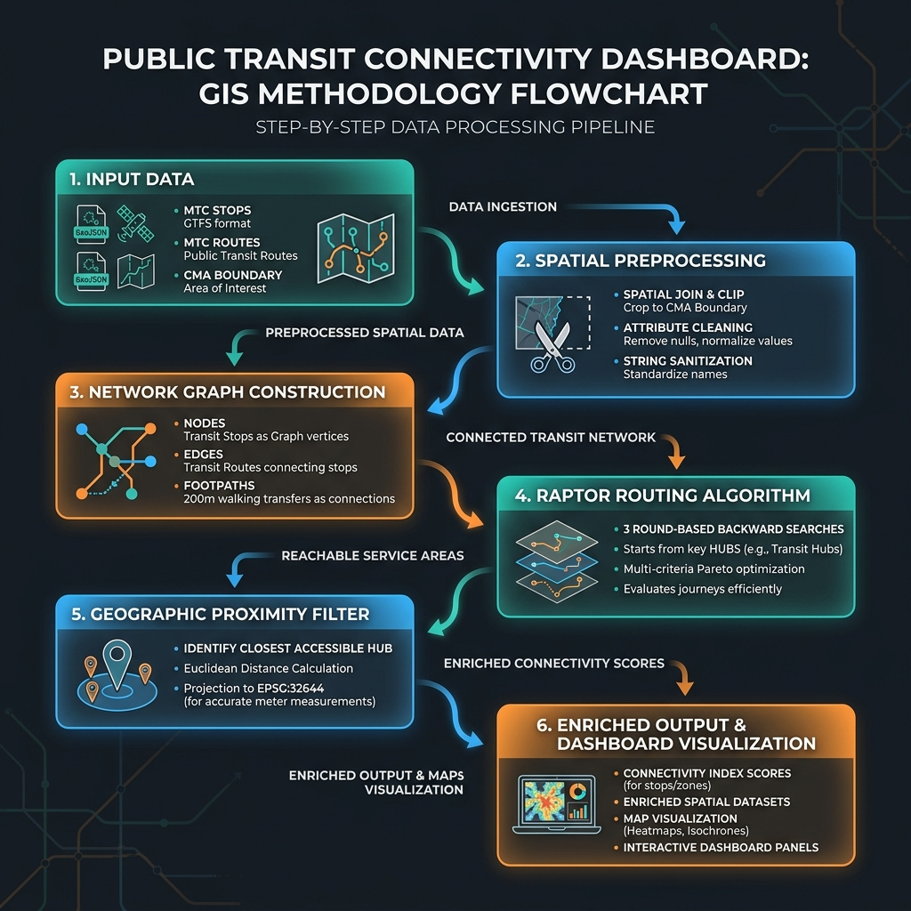
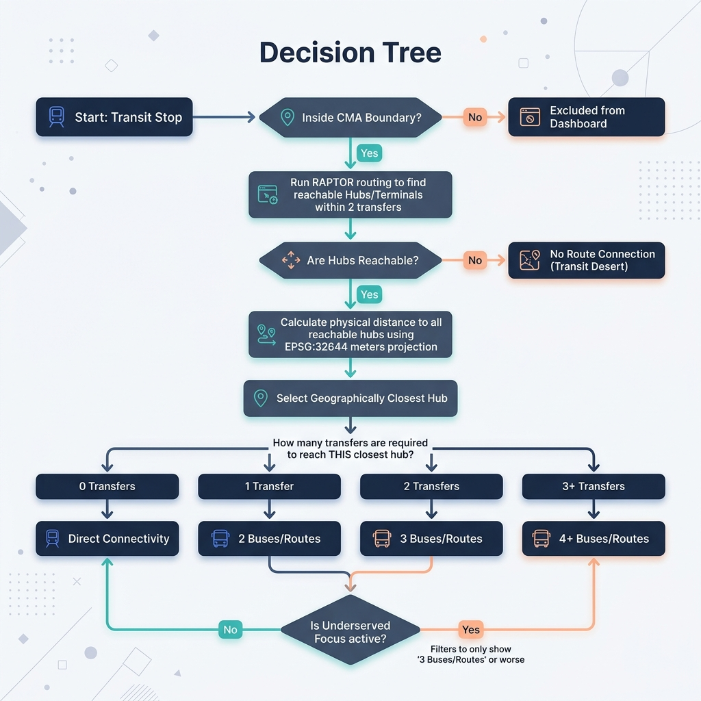

# Methodology & Technical Architecture Report
## Chennai Multimodal Transit Connectivity Dashboard

This document details the methodology, calculation logic, and technology stack used to develop the Chennai Multimodal Transit Connectivity Dashboard.

---

## Methodology Flowchart & Decision Tree

Below are the visual reference charts detailing the implementation methodology:
1. **System Methodology Flowchart**: The step-by-step data processing pipeline, from raw GIS inputs to graph construction, RAPTOR routing, and visualization.
2. **Stop Connectivity Classification Decision Tree**: The logical routing decision rules that determine the connectivity category of each stop based on geographic proximity to reachable transit hubs.

---

### 1. System ETL & Data Processing Flowchart

```mermaid
graph TD
    subgraph Input [1. Input Data Layers]
        BusStops["MTC Bus Stops (GeoJSON)"]
        BusRoutes["MTC Bus Routes (GeoJSON)"]
        Termini["Bus Termini (GeoJSON)"]
        Metro["Metro Stations & Corridors (GeoJSON)"]
        Suburban["Suburban Stations & Corridors (GeoJSON)"]
        CMABoundary["CMA Boundary Polygon"]
    end

    subgraph Preprocess [2. Spatial Ingestion & Preprocessing]
        BoundaryClip["Spatial Clip: Prune stops/routes outside CMA boundary"]
        TextSanitize["Name Sanitization: Lowercase & strip 'depot/terminus/stand'"]
        RouteRegex["Regex Route List Parsing: Parse semicolon/comma-separated strings"]
    end

    subgraph Graph [3. Network Graph Construction]
        Nodes["Nodes: Stops, Terminals, Metro/Suburban Stations"]
        RouteEdges["Route Edges: Connect stops sharing same route name"]
        WalkEdges["Walk Transfer Footpaths: Connect stops within 200m radius using STRtree"]
    end

    subgraph Raptor [4. RAPTOR Routing Engine]
        Round0["Round 0: Initialize accessible terminals (0 transfers)"]
        Round1["Round 1: Traverse direct routes (Direct / 0 transfers)"]
        Round2["Round 2: Traverse 1-transfer routes (2 buses/routes / 1 transfer)"]
        Round3["Round 3: Traverse 2-transfer routes (3 buses/routes / 2 transfers)"]
    end

    subgraph Proximity [5. Proximity & Representative Selection]
        ProjMeters["Coordinate Projection: Project coordinates from WGS84 to EPSG:32644 (meters)"]
        CalcDist["Euclidean Distance: Calculate distance to all reachable terminals"]
        ClosestHub["Select Closest: Sort by distance & select closest reachable terminal"]
        SetMetric["Set Score: Set connectivity metric based on that closest reachable terminal"]
    end

    subgraph Output [6. Outputs & Dashboard Visuals]
        StopsGeoJSON["bus_stops_connectivity.geojson"]
        SummaryStats["connectivity_summary.json"]
        LeafletMap["Interactive Leaflet Dashboard (index.html)"]
    end

    Input --> Preprocess
    Preprocess --> Graph
    Graph --> Raptor
    Raptor --> Proximity
    Proximity --> Output
```

---

### 2. Stop Connectivity Classification Decision Tree

---

## 1. System Architecture & Technologies

The system is designed as a two-tier architecture consisting of a heavy offline geospatial ETL (Extract, Transform, Load) pipeline and a lightweight frontend visualization layer.

### 1.1 Tech Stack
* **Python 3**: Core language for the ETL engine (`build_connectivity.py`).
* **GeoPandas & Fiona**: Used for reading, parsing, and manipulating GeoJSON datasets.
* **Shapely**: Powers the core geometric operations, spatial joins, and clipping. Specifically, `Shapely.prepared` is used for fast spatial containment checks, and `Shapely.strtree` is used for fast proximity indexing.
* **PyProj**: Used for precise Geographic to Projected Coordinate System transformations (WGS84 `EPSG:4326` to `EPSG:32644`), enabling accurate distance calculations in meters.
* **Leaflet.js**: Frontend mapping library used in `index.html` to render the GeoJSON outputs interactively without a heavy GIS server.

---

## 2. Methodology & Graph Construction

The core of the analysis relies on modeling the transit network as a spatial and relational graph. 

### 2.1 Node Definition
Nodes in the graph represent transit access points:
* **Bus Stops**: Extracted from `mtc_bus_stops_all.geojson`.
* **Bus Terminals / Depots**: A unified category combining explicitly mapped terminals and implied depots (inferred from route endpoints).
* **Metro Stations**: Explicitly modeled for the Blue and Green lines.
* **Suburban Stations**: Extracted from `suburban stations.geojson`.

### 2.2 Edge Construction (Routes & Walking)
The connections between nodes (edges) are formed in two ways:
1. **Route Edges**: Two stops are connected if they are served by the exact same transit route (bus route name, metro line, or suburban line).
2. **Walking Transfer Footpaths**: An R-Tree spatial index (`STRtree`) is constructed over all transit nodes. The system queries this index to link any two nodes located within **200 meters** of each other geographically. This represents a walkable transfer between stops or different transit modes.

### 2.3 Terminal Inference Logic
Because not all bus depots were mapped as point features in the raw data, the script uses a spatial inference technique:
* It analyzes the source/destination string attributes of all bus routes.
* If a route endpoint string contains the word "depot", the geographic ends of that route's LineString geometry are clustered.
* Mapped terminals are also spatially joined against route endpoints; any route terminating within **650 meters** of a mapped terminal is considered to serve that terminal directly.

---

## 3. Routing Calculations (RAPTOR Algorithm)

To determine how well-connected each stop is, the system implements a round-based public transit routing algorithm similar to **RAPTOR (Round-Based Public Transit Routing)**.

### 3.1 Dual Analysis Modes
The RAPTOR algorithm is executed twice to create two distinct datasets:
1. **Bus-Only Network**: Restricts valid edges strictly to MTC Bus routes and walking paths between bus stops/terminals.
2. **Multimodal Network**: Expands the graph to include Metro and Suburban rail lines as valid transit segments.

### 3.2 Closest Facility Distance & Routing Selection
For every stop, the algorithm tracks **all** terminals/hubs it can reach in the transit graph within 3 rounds (up to 2 transfers). To select the representative terminal/hub for a stop:
1. The coordinates of the stop and all its accessible terminals are projected from degrees (`EPSG:4326`) to meters (`EPSG:32644`) using PyProj.
2. A straight-line Euclidean distance is calculated between the stop and each of the accessible terminals.
3. The terminal with the smallest geographic distance is selected as the **Closest Terminal** (or **Closest Hub** in Multimodal mode) and reported in kilometers on the dashboard's proximity tooltip.
4. The stop's connectivity score (hops/transfers) is set to match the specific route-transfer distance to **that geographically closest reachable terminal**. This ensures that the connectivity metric is tied to the physical proximity of the nearest reachable hub, rather than a far-away direct terminal.

### 3.3 Connectivity Classification
Stops are classified based on the transfers required to reach their geographically closest reachable terminal/hub:
* **Direct**: The stop can reach its closest terminal in a single transit route segment (0 transfers).
* **2 buses/routes**: Requires taking 1 route, walking/transferring, and taking a 2nd route (1 transfer).
* **3 buses/routes**: Requires 2 transfers.
* **4+ buses/routes**: Requires 3 or more transfers (often considered a "transit desert").
* **No route connection**: The stop cannot reach any terminal/hub via the transit graph.

### 3.4 Underserved Focus definition
The dashboard features an "Underserved Focus" analysis layer that isolates and displays stops with poor connectivity. To target the true transit deserts, this focus is defined as stops requiring **2 or more transfers** (`3 buses` / `3 routes` or worse, as well as disconnected stops), excluding stops with direct or 1-transfer connectivity.

---

## 4. Spatial Processing & QA 

* **Strict Boundary Clipping**: Using `Shapely.prepared`, a unified boundary of the Chennai Metropolitan Area (CMA) is created. All stops and routes are clipped; stops outside the CMA boundary are discarded from the final dashboard output to maintain strict geographical scope.
* **QA Overrides**: A manual QA dictionary forces specific stops (e.g., Kundrathur Bus Depot, CMBT) into the "Direct" connectivity category to correct for upstream malformed strings in the raw stop attributes that the automated parser could not link.

---

## 5. Logic & Data Purity

Maintaining clean and reliable connectivity graphs required significant data purity and normalization logic due to inconsistencies in the raw MTC route and stop datasets:

### 5.1 String Normalization and Sanitization
The raw data contained highly variable text strings for stops, routes, and destinations. The ETL pipeline implements a strict sanitization protocol:
* **Token Standardization**: Words like "bus", "mtc", "terminus", "terminal", "stand", "depot", "jn", and "junction" are systematically stripped out of route endpoint labels and stop names to prevent mismatching due to minor naming variations.
* **Non-Alphanumeric Stripping**: Special characters are converted to spaces, and all strings are collapsed into lowercase, single-spaced standard strings.

### 5.2 Malformed Route Array Parsing
In the source `mtc_bus_stops_all.geojson` data, the `route name` field was often a malformed text string (e.g., strings containing brackets, commas, semicolons, and quotes) instead of a clean JSON array. 
* A custom string parser uses regular expressions (`re.split(r"[,;/]", value)`) to clean bracket and quote characters and reconstruct valid lists of routes serving each stop. This prevented many stops from falsely registering as "No route connection" (such as the Metrological Department Sterling Road stop which produced 27 valid matches after cleaning).

### 5.3 QA Interventions
Despite algorithmic cleaning, manual QA interventions were applied to guarantee data integrity:
* Hardcoded validations override the algorithm for specific critical infrastructure nodes whose upstream route strings were too malformed to parse automatically. For instance, "Chennai Koyambedu Mofussil Bus Stand" and "Kundrathur Bus Depot" were explicitly mapped as "Direct" connectivity points based on manual map validation.
